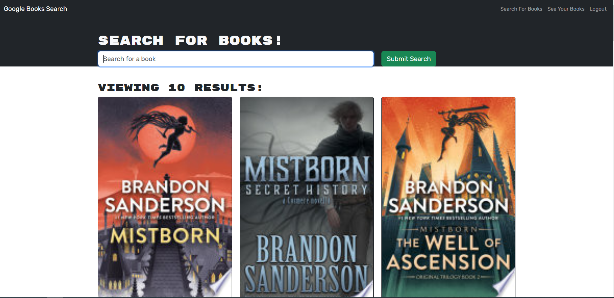

# Book Search Engine

## Description

App that allows users to search for books and add books to their collection.

Link to deployed application: 

## Table of Contents
- [Installation](#installation)
- [Usage](#usage)- [Technologies Used](#technologies-used)
- [Tests](#tests)
- [Questions](#questions)

## Installation

N/A

## Usage

In the upper right hand corner of the navigation bar, click "Login/Sign Up" to search log in or sign up for an account. Once logged in, enter the title of a book into the search bar and click "Submit Search" to populate the page with relevant books. Books will be displayed with image, title, author(s), and description. Click "Save this Book!" to add a book to your collection. You may view the books in your collection by navigating to "See Your Books". If you want to remove a book from your collection, click the book's corresponding button labeled "Delete this Book!". To return to book search, click the button labeled "Search For Books". To log out, click on the "Logout" button.

## Contributing

Front-end: REACT
Back-end: GraphQL

## Tests

N/A

## Questions

GitHub Profile: github.com/ETFruitNinja

Email: jeffreyyehuw@gmail.com